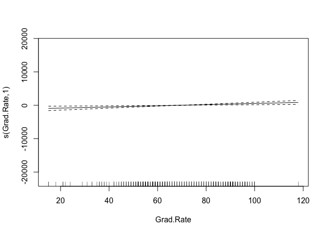
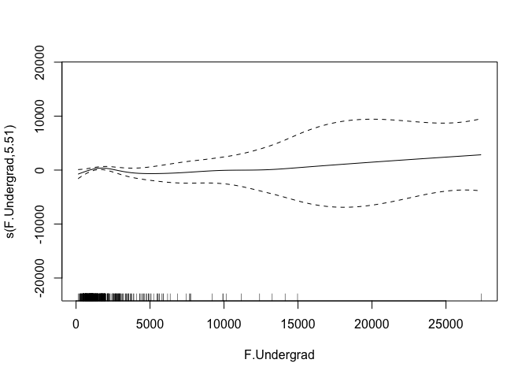
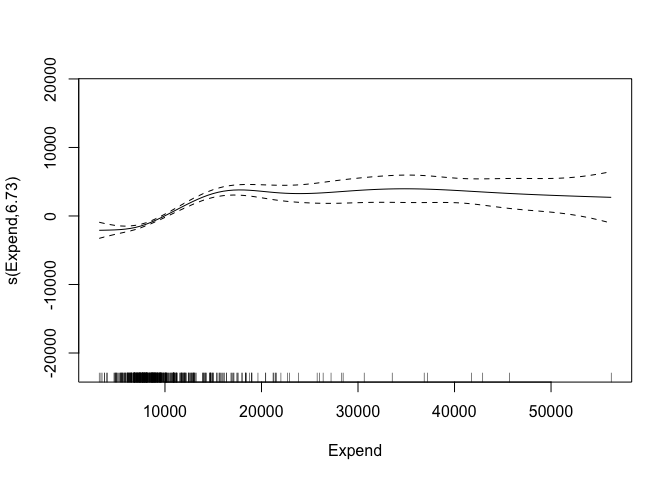

P8106 Data Science II Homework 2: Predicting Out-of-State Tuition Costs
================
Sarah Forrest - sef2183
3/12/2023

# Data

In this exercise, we build nonlinear models using the “College” data.
The dataset contains statistics for 565 US Colleges from a previous
issue of US News and World Report. The response variable is the
out-of-state tuition (Outstate).

``` r
# read in test data
College = read.csv("data/College.csv") 
```

Partition the dataset into two parts: training data (80%) and test data
(20%).

``` r
set.seed(1)

# specify rows of training data (80% of the dataset)
trRows <- createDataPartition(College$Outstate, 
                              p = .8,
                              list = F)

# training data
College_train <- College[trRows, ]
## matrix of predictors
x <- model.matrix(Outstate~.,College)[trRows,-1]
## vector of response
y <- College$Outstate[trRows]

# test data
College_test <- College[-trRows, ]
## matrix of predictors
x2 <- model.matrix(Outstate~.,College)[-trRows,-1]
## vector of response
y2 <- College$Outstate[-trRows]
```

# (a) Fit smoothing spline models using the training data set and perc.alumni as the only predictor of Outstate

**For a range of degrees of freedom (df):**

``` r
set.seed(1)

# fit smoothing spline model with df = 5
fit.ss_df5 <- smooth.spline(College_train$perc.alumni, College_train$Outstate, df = 5)

# fit smoothing spline model with df = 2
fit.ss_df2 <- smooth.spline(College_train$perc.alumni, College_train$Outstate, df = 2)

# fit smoothing spline model with df = 8
fit.ss_df8 <- smooth.spline(College_train$perc.alumni, College_train$Outstate, df = 8)
```

**For the degree of freedom obtained by generalized cross-validation:**

``` r
set.seed(1)

# fit smoothing spline model with df obtained by generalized cross-validation
fit.ss <- smooth.spline(College_train$perc.alumni, College_train$Outstate) 

# retrieve df obtained by generalized cross-validation
fit.ss$df
```

    ## [1] 3.779231

The degree of freedom obtained by generalized cross-validation is
3.779231.

``` r
set.seed(1)

# Note that the range of perc.alumni is [2,64], and this is only for
# illustrating fitted curve beyond the boundary knots
perc.alumni.grid <- seq(from = -8, to = 74, by = 1)

# df = 5
pred.ss_df5 <- predict(fit.ss_df5,
                   x = perc.alumni.grid)

pred.ss.df_5 <- data.frame(pred = pred.ss_df5$y,
                         perc.alumni = perc.alumni.grid)

# df = 2
pred.ss_df2 <- predict(fit.ss_df2,
                   x = perc.alumni.grid)

pred.ss.df_2 <- data.frame(pred = pred.ss_df2$y,
                         perc.alumni = perc.alumni.grid)

# df = 8
pred.ss_df8 <- predict(fit.ss_df8,
                   x = perc.alumni.grid)

pred.ss.df_8 <- data.frame(pred = pred.ss_df8$y,
                         perc.alumni = perc.alumni.grid)

# df obtained by generalized cross-validation
pred.ss <- predict(fit.ss,
                   x = perc.alumni.grid)

pred.ss.df <- data.frame(pred = pred.ss$y,
                         perc.alumni = perc.alumni.grid)
```

## Plot of the resulting fits

``` r
# create scatter plot object 'p' of the data points
# perc.alumni on the x-axis and Outstate on the y-axis
p <- ggplot(data = College, aes(x = perc.alumni, y = Outstate)) +
  geom_point(color = rgb(.2, .4, .2, .5))
```

**Plot for df = 5**

``` r
p +
  geom_line(aes(x = perc.alumni, y = pred), data = pred.ss.df_5,
            color = rgb(.8, .1, .1, 1)) + theme_bw()
```

<!-- -->

**Plot for df = 2**

``` r
p +
  geom_line(aes(x = perc.alumni, y = pred), data = pred.ss.df_2,
            color = rgb(.8, .1, .1, 1)) + theme_bw()
```

<!-- -->

**Plot for df = 8**

``` r
p +
  geom_line(aes(x = perc.alumni, y = pred), data = pred.ss.df_8,
            color = rgb(.8, .1, .1, 1)) + theme_bw()
```

<!-- -->

**Plot for df obtained by generalized cross-validation**

``` r
p +
  geom_line(aes(x = perc.alumni, y = pred), data = pred.ss.df,
            color = rgb(.8, .1, .1, 1)) + theme_bw()
```

<!-- -->

## Description of the results

**For df = 5:**

The plot of the smoothing spline fit for df = 5 has a bit of a curve in
the first half of the line (near the lower values of
``` perc.alomni``(x) ``` and `Outstate`), making it non-linear. A
positive (i.e., upward) relationship between `perc.alomni`(x) and
`Outstate` (y) can be observed from the plot. The plot is non-linear
because the specified df is 5, which greater than 2 and makes the plot
non-linear and slightly curvy.

**For df = 2:**

The plot of the smoothing spline fit for df = 2 appears linear, with a p
positive (i.e., upward) relationship between `perc.alomni`(x) and
`Outstate` (y). The plot is linear because the specified df is 2, making
it similar to a second degree polynomial resulting in a linear plot.

**For df = 8:**

The plot of the smoothing spline fit for df = 8 is the curviest (most
non-linear) yet because it has the highest value specified for the df.
Distinct curves in the line are present, with a larger curve in the
first half of the line (near the lower values of
``` perc.alomni``(x) ``` and `Outstate`). A positive (i.e., upward)
relationship between `perc.alomni`(x) and `Outstate` (y) can be observed
from the plot. The plot is non-linear because the specified df is 8,
which quite a bit larger than 2 and makes the plot non-linear and curvy.

**For df obtained by generalized cross-validation:**

The plot of the smoothing spline fit for the df obtained by generalized
cross-validation (3.779231) is slightly curvy, with a positive (i.e.,
upward) relationship between `perc.alomni`(x) and `Outstate` (y). There
is a slight curve present in the first half of the line (near the lower
values of ``` perc.alomni``(x) ``` and `Outstate`), while the rest of
the line appears fairly linear. The plot is slighly curvy because the df
obtained by generalized cross-validation is a bit larger than 2, making
the plot non-linear and slightly curvy.

# (b) Fit a generalized additive model (GAM) using all the predictors.

Using the caret package and the training dataset:

``` r
set.seed(1)

# 10-fold cross-validation repeated 5 times 
ctrl1 <- trainControl(method = "cv", number = 10)

# fit GAM using all predictors
gam.fit_all <- train(x, y, # test dataset
                 method = "gam",
                 trControl = ctrl1, # 10-fold CV
                 control = gam.control(maxit = 200)) # Adjusted due to failure to converge at default setting
```

    ## Warning: model fit failed for Fold08: select= TRUE, method=GCV.Cp Error in magic(G$y, G$X, msp, G$S, G$off, L = G$L, lsp0 = G$lsp0, G$rank,  : 
    ##   magic, the gcv/ubre optimizer, failed to converge after 400 iterations.

    ## Warning in nominalTrainWorkflow(x = x, y = y, wts = weights, info = trainInfo, :
    ## There were missing values in resampled performance measures.

``` r
gam.fit_all$bestTune
```

    ##   select method
    ## 1  FALSE GCV.Cp

``` r
# fit GAM using selection specification
gam.fit_select <- train(x, y, # test dataset
                 method = "gam",
                 tuneGrid = data.frame(method = "GCV.Cp", select = c(TRUE)),
                 trControl = ctrl1, # 10-fold CV
                 control = gam.control(maxit = 200))  # Adjusted due to failure to converge at default setting
```

    ## Warning: model fit failed for Fold01: method=GCV.Cp, select=TRUE Error in magic(G$y, G$X, msp, G$S, G$off, L = G$L, lsp0 = G$lsp0, G$rank,  : 
    ##   magic, the gcv/ubre optimizer, failed to converge after 400 iterations.

    ## Warning: There were missing values in resampled performance measures.

``` r
gam.fit_select$bestTune
```

    ##   select method
    ## 1   TRUE GCV.Cp

## Predictors included in GAM model

**The final GAM model for all predictors is as follows:**

``` r
# GAM using all predictors
gam.fit_all$finalModel
```

    ## 
    ## Family: gaussian 
    ## Link function: identity 
    ## 
    ## Formula:
    ## .outcome ~ s(perc.alumni) + s(Terminal) + s(Books) + s(Grad.Rate) + 
    ##     s(PhD) + s(Top10perc) + s(Top25perc) + s(S.F.Ratio) + s(Personal) + 
    ##     s(P.Undergrad) + s(Room.Board) + s(Enroll) + s(Accept) + 
    ##     s(F.Undergrad) + s(Apps) + s(Expend)
    ## 
    ## Estimated degrees of freedom:
    ## 6.05 1.00 2.17 3.56 1.81 1.00 1.00 
    ## 3.69 1.00 1.00 2.47 1.00 4.19 5.51 
    ## 4.45 6.87  total = 47.75 
    ## 
    ## GCV score: 2824207

Outstate \~ s(perc.alumni) + s(Terminal) + s(Books) + s(Grad.Rate) +
s(PhD) + s(Top10perc) + s(Top25perc) + s(S.F.Ratio) + s(Personal) +
s(P.Undergrad) + s(Room.Board) + s(Enroll) + s(Accept) + s(F.Undergrad)
+ s(Apps) + s(Expend)

Estimated degrees of freedom (for each predictor and total sum): 6.05
1.00 2.17 3.56 1.81 1.00 1.00 3.69 1.00 1.00 2.47 1.00 4.19 5.51 4.45
6.87 total = 47.75

GCV score: 2824207

**The final GAM model for the selection specification:**

# GAM using selection specification

``` r
gam.fit_select$finalModel
```

    ## 
    ## Family: gaussian 
    ## Link function: identity 
    ## 
    ## Formula:
    ## .outcome ~ s(perc.alumni) + s(Terminal) + s(Books) + s(Grad.Rate) + 
    ##     s(PhD) + s(Top10perc) + s(Top25perc) + s(S.F.Ratio) + s(Personal) + 
    ##     s(P.Undergrad) + s(Room.Board) + s(Enroll) + s(Accept) + 
    ##     s(F.Undergrad) + s(Apps) + s(Expend)
    ## 
    ## Estimated degrees of freedom:
    ## 6.077 0.198 1.095 1.437 0.000 0.832 0.000 
    ## 3.853 0.638 0.796 3.770 1.000 4.625 5.917 
    ## 4.603 5.930  total = 41.77 
    ## 
    ## GCV score: 2766492

The estimated degrees of freedom (for each predictor and total sum):
6.077 0.198 1.095 1.437 **0.000** 0.832 **0.000** 3.853 0.638 0.796
3.770 1.000 4.625 5.917 4.603 5.930 total = 41.77

GCV score: 2766492

Since the df for the 5th predictor (`PhD`) and 7th predictor
(`Top25perc`) are 0, these two variables were removed from the final
mode. Therefore, the final model using the selection specification is as
follows:

Outstate \~ s(perc.alumni) + s(Terminal) + s(Books) + s(Grad.Rate) +
s(Top10perc) + s(S.F.Ratio) + s(Personal) + s(P.Undergrad) +
s(Room.Board) + s(Enroll) + s(Accept) + s(F.Undergrad) + s(Apps) +
s(Expend)

**The full model contains all 16 predictors, while the model using the
selection specification only has 14 predictors, with PhD and Top25perc
removed from the final model. All predictors have the s operator
added.**

## Plot of the results

Predictor plots:

``` r
set.seed(1)

# Formula based on final GAM model with 14 predictors (gam.fit_select)
gam.m1 <- gam(Outstate ~ s(perc.alumni) + s(Terminal) + s(Books) + 
                s(Grad.Rate)+ s(Top10perc) + s(S.F.Ratio) + s(Personal) + 
                s(P.Undergrad) + s(Room.Board) + s(Enroll) + s(Accept) +
                s(F.Undergrad) + s(Apps) + s(Expend), 
              data = College_train) # training dataset

plot(gam.m1)
```

<!-- --><!-- --><!-- --><!-- --><!-- --><!-- --><!-- --><!-- --><!-- --><!-- --><!-- --><!-- --><!-- --><!-- -->

Bivariate plot for the arbitrarily chosen `Apps` and `Accept` predictor
variables:

``` r
vis.gam(gam.m1, view = c("Apps", "Accept"),
color = "topo")
```

<!-- -->

## Explanation of findings

From the plot, it can be observed that most of the predictors have a
fairly small credible interval window, which may be used as an
approximation of the 95% confidence interval. A small credible interval
window for predictors means that the uncertainty of the estimate is
small and variability is small, indicating the the curve can be
“trusted” for these predictors. However, it’s also worth noting that a
few predictors have a larger credible interval window at higher values
of the predictor. For example, the plots for the `Accept` and
`F.Undergrad` predictors show a credible interval window that is small
at smaller values for the variables, and lets larger for larger values
of the variables. This indicates that the the uncertainty of the
estimate increases for larger values of the predictors and perhaps the
curve shouldn’t be “trusted” as easily for data points that fall within
these larger values.

## Test error

The test error should be retrieved by first fitting the GAM model using
the test dataset and then using it to calculate the test error. However,
I has running into difficulty with my code not running when I fit the
model using the test dataset. I’m curious if there are not enough data
points for it to run properly using the specifications. I emailed the
teaching team about this issue on 3/9. For purposes of this timely
submission of my homework, I am calculating the error for the model fit
using the training dataset here. However, I acknowledge that this is not
aligned with best practices.

``` r
set.seed(1)

# test error using GAM fit for all predictors
# gam.fit_test_all <- train(x2, y2, # test dataset 
                 # method = "gam",
                 # trControl = ctrl1, # 10-fold CV
                 # control = gam.control(maxit = 200)) # Adjusted due to failure to converge at default

# gam.fit_test_all$results$RMSE

gam.fit_all$results$RMSE # Using previous model because the code woudln't run with test data
```

    ## [1] 1785.113 1833.612

``` r
# test error using GAM fit for selection specification
# gam.fit_test_select <- train(x2, y2, # test dataset
                 # method = "gam",
                 # tuneGrid = data.frame(method = "GCV.Cp", select = c(TRUE)),
                 # trControl = ctrl1, # 10-fold CV
                 # control = gam.control(maxit = 200)) # Adjusted due to failure to converge at default

# gam.fit_test_select$results$RMSE
```

The error for the GAM model fit for all predictors using the model fit
with the training data is 1759.699 1848.859.

# (c) Multivariate adaptive regression spline (MARS) model using all the predictors.

Fit MARS model using the caret package and training dataset:

``` r
set.seed(1)

# create grid of all possible pairs that can take degree and nprune values
mars_grid <- expand.grid(degree = 1:3, # number of possible product hinge functions in 1 term
                         nprune = 2:16) # Upper bound of number of terms in model

mars.fit <- train(x, y, # training dataset
                  method = "earth",
                  tuneGrid = mars_grid,
                  trControl = ctrl1) # 10-fold CV

ggplot(mars.fit)
```

<!-- -->

``` r
mars.fit$bestTune
```

    ##    nprune degree
    ## 14     15      1

The upper bound of the number of terms in the MARS model is 15 based on
the minimum value for RMSE in the plot. Also, the model that appears to
be the best in terms of the cross validation error is the model with a
product degree of 1.

The final MARS model contains the following predictors, coefficients,
and hinge functions:

``` r
coef(mars.fit$finalModel)
```

    ##                 (Intercept)             h(Expend-15736) 
    ##               11990.4787273                  -0.7057251 
    ##             h(79-Grad.Rate)          h(Room.Board-4250) 
    ##                 -33.9331530                   0.4027510 
    ##          h(4250-Room.Board)         h(F.Undergrad-1411) 
    ##                  -1.2922196                  -1.2632483 
    ##           h(22-perc.alumni)              h(Expend-6874) 
    ##                 -88.2417155                   0.6963456 
    ##   CollegeBennington College      CollegeSpelman College 
    ##                6674.2643400               -6243.6619045 
    ##              h(1656-Accept) CollegeCreighton University 
    ##                  -1.5964172               -5804.7888985 
    ##  CollegeLivingstone College                 h(Apps-946) 
    ##               -5741.1315285                   0.2744830 
    ##         h(F.Undergrad-3128) 
    ##                   0.9641141

The final MARS model includes 10 hinge functions for the following
predictors: `Expend` (pair), `Grad.Rate`, `Room.Board` (reflective
pair), `F.Undergrad`, `perc.alumni`, `Accept`, `Apps`, and
`F.Undergrad`.

The final model is as follows:

Outstate \~ 11990.478727 - 0.7057251(h(Expend-15736)) -
33.9331530(h(79-Grad.Rate)) + 0.4027510(h(Room.Board-4250)) -
1.2922196(h(4250-Room.Board)) - 1.2632483(h(F.Undergrad-1411)) -
88.2417155(h(22-perc.alumni)) + 0.6963456(h(Expend-6874)) +
6674.2643400(CollegeBennington College) - 243.6619045(CollegeSpelman
College) - 1.5964172(h(1656-Accept)) - 5804.7888985(CollegeCreighton
University) - 5741.1315285(CollegeLivingstone College) + 0.2744830
(h(Apps-946)) + 0.9641141(h(F.Undergrad-3128))

## Partial dependence plots

Plot of a single arbitrary predictor in the final model `perc.alumni`:

``` r
p1 <- pdp::partial(mars.fit, 
                   pred.var = c("perc.alumni"), 
                   grid.resolution = 10) %>% 
  autoplot()

p1
```

<!-- -->

Plot of an interaction partial dependence plot between arbitrary
predictors in the final model `Apps` and `Accept`:

``` r
p2 <- pdp::partial(mars.fit, 
                   pred.var = c("Apps", "Accept"),
                   grid.resolution = 10) %>%
  pdp::plotPartial(levelplot = FALSE, 
                   zlab = "yhat", 
                   drape = TRUE,
                   screen = list(z = 20, x = -60))

p2
```

<!-- -->

Both partial dependence plots combined:

``` r
grid.arrange(p1, p2, ncol = 2)
```

<!-- -->

The partial dependence plots above allow for better understanding of the
relationship between the `perc.alumni`, `Apps`, and `Accept` features
and the outcome `Outstate` and the marginal effects of these predictors.

## Test error

Fit model using the test dataset and calculate the test error:

``` r
set.seed(1)

mars.fit_test <- train(x2, y2, # test dataset
                  method = "earth",
                  tuneGrid = mars_grid,
                  trControl = ctrl1) # 10-fold CV

mars.fit_test$results$RMSE
```

    ##  [1] 2204.917 2122.136 2159.673 2041.297 2215.930 2166.897 2059.312 2206.141
    ##  [9] 2262.332 1912.192 1997.782 2075.348 1919.975 2198.623 2372.489 1885.352
    ## [17] 2228.544 2174.672 1913.535 2174.585 2109.206 1904.036 2194.783 2105.128
    ## [25] 1916.521 2207.314 2384.038 1971.612 2265.302 2379.313 1982.716 2305.072
    ## [33] 2374.530 2021.322 2258.392 2524.099 2027.059 2300.720 2516.018 1999.069
    ## [41] 2287.392 2483.779 1978.073 2510.076 2689.759

# (d) Preference for the use of MARS model over a linear model when predicting the out-of-state tuition.

The choice between a MARS model and a linear model for calculating
out-of-state tuition costs from a set of predictors would depend on the
nature of the data and predictors desired, as well as the degree of
complexity that the researcher is comfortable with in their model.

If the relationship between the predictors and the outcome (i.e., the
out-of-state tuition costs) is expected to be linear or relatively
straightforward, a linear model is appropriate and may be preferred
because it is a simple model. Linear models assume a linear relationship
between the predictors and the outcome, and are well-suited for general
application situations where the predictor variables have a clear and
direct impact on the outcome.

However, if there is reason to believe that the relationship between the
predictors and the outcome is non-linear or more complex, a MARS model
may be more appropriate, even though it is a much more complex model.
MARS models are able to capture non-linear relationships by creating
piecewise linear regression functions, and can be useful for handling
interactions between predictors.

All of this said, for general applications, I only think that the MARS
is a better approach compared to a linear model if the relationship
between the predictors and the outcome is non-linear. If the
relationship is somewhat linear, then a linear model is preferred in
general applications because it is much simpler.
